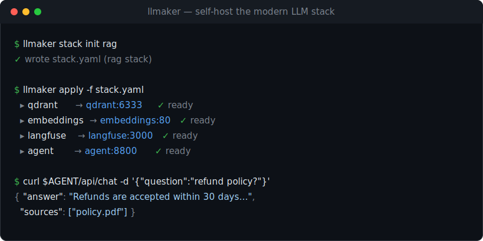

<div align="center">

# llmaker

### Self-host the modern LLM stack.

**llmaker is an open-source platform for running the complete modern LLM stack on
your own infrastructure** — large language models, vector databases, embeddings,
caching, observability, and a built-in retrieval & agent layer — provisioned,
networked, and production-shaped from a single command.

Build private retrieval-augmented chatbots, FAQ assistants, and recommendation
engines locally. No third-party API keys. No data leaving your machine.

<br/>

<!--
  DEMO SLOT — docs/demo.svg is a placeholder mock. Replace it with a real
  terminal recording for maximum impact:
    • record with vhs (https://github.com/charmbracelet/vhs), or asciinema + agg
    • good script: `llmaker apply` bringing a stack up, then `llmaker top`
    • save as docs/demo.gif and change the src below from demo.svg to demo.gif
-->
<a href="#quickstart"></a>

<br/>

[](https://github.com/raiyanyahya/llmaker/actions/workflows/ci.yml)
[](https://goreportcard.com/report/github.com/raiyanyahya/llmaker)
[](#why-self-host-your-llm-stack)
[](LICENSE)
[](#roadmap)

[](go.mod)
[](agent/)
[](https://docs.docker.com/get-docker/)
[](facade/)
[](https://langchain-ai.github.io/langgraph/)
[](https://ollama.com)
[](#hardware--images)

[](https://github.com/raiyanyahya/llmaker)
[](#contributing)

[Quickstart](#quickstart) · [Why llmaker](#why-self-host-your-llm-stack) · [Stacks](#stacks) · [The agent](#the-agent) · [Architecture](#architecture) · [CLI](#cli-reference) · [Roadmap](#roadmap)

</div>

---

## Overview

Running a model locally is easy. Shipping an *application* is not. A production
retrieval system needs a vector database, an embeddings service, a caching layer,
an orchestration layer, and observability — each containerized, networked, and
configured to discover the others. Assembling that is a recurring tax: a sprawl of
`docker run` flags, a brittle Compose file, and hundreds of lines of framework glue.

llmaker removes that tax. One CLI provisions the entire stack on a private network
and **operates it as a single fleet** — live status, logs, and a resource
dashboard across every model and service. Stacks are **declarative and
reconcilable** (`apply --prune`), models are **OpenAI-compatible**, and retrieval
is **traced out of the box**. From a single model to a complete application:

```bash
# ── Build a complete application stack ──────────────────────────
llmaker stack up assistant      # one command → a private ChatGPT-style UI over a local model
llmaker stack init rag          # …or scaffold any stack to edit, then apply it:
llmaker apply                   #   assistant · voice · rag · research · code · chatbot · faq · recommend · sql

# ── …or run a single model (OpenAI-compatible) ──────────────────
llmaker up --model llama3:8b    # a local endpoint — explicit, or a preset:
llmaker up chat                 #   chat · code · small · embed · vision
llmaker chat <name>             # test it in the terminal
llmaker open <name>             # open its built-in web UI

# ── …or compose the stack à la carte, service by service ────────
llmaker service catalog         # browse what's available
llmaker service add qdrant      # vector database  → qdrant:6333
llmaker service add redis       # cache / memory   → redis:6379
llmaker service add langfuse    # observability    → langfuse:3000

# ── Operate the fleet ───────────────────────────────────────────
llmaker ls                      # every model + service, one view   (--json)
llmaker top                     # live resource dashboard (TUI)
llmaker status <name>           # gauges, loaded models, endpoints
llmaker logs <name> -f          # stream logs from any container
llmaker pull mistral --on chat  # download a model with progress
llmaker stop / start / rm       # lifecycle management

# ── Consume it — the agent's API, or any OpenAI client ──────────
AGENT=$(llmaker service ls --json | jq -r '.[]|select(.service=="agent").url')
curl "$AGENT/api/ingest"    -F file=@handbook.pdf            # add knowledge
curl "$AGENT/api/chat"      -d '{"question":"refund policy?"}'   # grounded answer + sources
curl "$AGENT/api/recommend" -d '{"like":["sku1","sku2"]}'   # semantic recommendations
```

Everything lands on a private network where each container discovers the others
by name — no Compose file and no glue code.

---

## Highlights

| | |
|---|---|
| **The complete stack, curated** | Models **and** the infrastructure around them — vector databases (Qdrant, Chroma, pgvector, Weaviate), Redis, embeddings, Open WebUI, n8n, Flowise, Whisper, Langfuse — from one versioned catalog. |
| **Automatic service discovery** | Every model and service joins a private Docker network and resolves by name. Your application reaches `chat:8080` and `qdrant:6333` with zero IP wiring. |
| **A retrieval & tool agent, built in** | A FastAPI + LangGraph service: `rewrite → retrieve → rerank → generate` (multi-turn, MMR), a tool-calling loop (calculator, knowledge base, self-hosted web search, SQL), and a semantic recommendation API. |
| **Observability by default** | Every instance exposes Prometheus `/metrics` (requests, tokens/sec, CPU/RAM/GPU) for scraping, and the RAG stack ships Langfuse — every query traced (retrieval hits and scores, model and token usage) with no setup. |
| **Measurable quality** | An evaluation harness (`/api/eval`) grades answers for groundedness, relevance, and correctness with an LLM judge — retrieval quality you can track across changes, not guess at. |
| **More than RAG** | First-class endpoints for summarization (map-reduce over long docs), structured JSON extraction, and speech-to-text (Whisper), plus optional Redis-backed conversation memory. |
| **Declarative, reconcilable** | Define your stack in one file. `llmaker apply` brings it to the desired state in dependency order; `--prune` removes what's no longer declared. |
| **OpenAI-compatible** | Each model exposes a stable `/v1/*` API (chat, completions, embeddings, streaming) behind one contract — Ollama runs it today, with a llama.cpp backend [in progress](#roadmap). |
| **Private by design** | Containers bind to `127.0.0.1` by default. Your documents, embeddings, and traces never leave your infrastructure. No per-token cost, no vendor lock-in. |
| **Operable** | A single static Go binary, a labeled-container model with no state file to drift, `--json` output everywhere, and a live `top` dashboard. |

---

## Why self-host your LLM stack?

- **Data ownership.** Proprietary documents, customer data, and prompts stay on
  hardware you control. Nothing is sent to a third-party API.
- **No assembly tax.** The vector DB, embeddings, cache, agent, and tracing come
  pre-integrated and networked — not as a Compose file you maintain by hand.
- **Predictable cost.** Inference and retrieval run on infrastructure you already
  pay for. No per-token billing, no rate limits.
- **Portability.** The same `stack.yaml` runs on a laptop, a CI runner, or a
  server. Swap the model or the vector database without touching your application.

| | Model runners<br/>(Ollama, LM&nbsp;Studio) | DIY<br/>Docker&nbsp;Compose | Frameworks<br/>(LangChain) | **llmaker** |
|---|:---:|:---:|:---:|:---:|
| Run local models, OpenAI-compatible | ✓ | — | — | ✓ |
| Vector DB, embeddings, cache — curated | — | manual | — | ✓ |
| Service discovery between containers | — | manual | n/a | ✓ |
| One-command application (RAG, recsys) | — | — | — | ✓ |
| Built-in retrieval & recommendation agent | — | — | you code it | ✓ |
| Observability / tracing integrated | — | manual | manual | ✓ |
| Declarative provisioning & reconciliation | — | partial | — | ✓ |

---

## Installation

> Requires [Docker](https://docs.docker.com/get-docker/). Run `llmaker doctor` afterward to validate your environment.

```bash
# Prebuilt binary (Linux / macOS)
curl -fsSL https://raw.githubusercontent.com/raiyanyahya/llmaker/master/scripts/install.sh | sh

# Go toolchain
go install github.com/raiyanyahya/llmaker/cmd/llmaker@latest

# From source
git clone https://github.com/raiyanyahya/llmaker && cd llmaker && make build
```

<sub>Homebrew and `winget` packages are on the [roadmap](#roadmap). The agent image is built locally with `make image-agent` until it is published to a registry.</sub>

---

## Quickstart

Provision and run a complete retrieval-augmented generation stack:

```bash
llmaker stack up assistant    # scaffold + apply in one step (assistant needs no agent image)
llmaker stack init rag        # generate stack.yaml (assistant | voice | rag | research | code | chatbot | faq | recommend | sql)
make image-agent              # build the agent image once (stacks that include the agent)
llmaker apply -f stack.yaml   # provision the stack — model + services, networked
llmaker ls                    # inspect models and services in one view
```

Resolve the agent endpoint and use it:

```bash
AGENT=$(llmaker service ls --json | jq -r '.[] | select(.service=="agent").url')

curl "$AGENT/api/ingest" -F file=@handbook.pdf                     # ingest documents
curl "$AGENT/api/chat"   -d '{"question":"…","history":[],"top_k":4}'   # query, with sources
```

llmaker also runs individual models — the easiest way to expose a local,
OpenAI-compatible endpoint:

```bash
llmaker up --model llama3:8b          # provision a model instance
```
```python
from openai import OpenAI
client = OpenAI(base_url="http://127.0.0.1:11500/v1", api_key="not-needed")
client.chat.completions.create(model="llama3:8b",
    messages=[{"role": "user", "content": "Hello"}])
```

---

## Stacks

A stack is a model plus the services around it, provisioned together. Scaffold
and run one in a single step with `llmaker stack up <name>`, or generate a
`stack.yaml` to edit with `llmaker stack init <name>` and apply it with
`llmaker apply`.

| Template | Application | Components |
|---|---|---|
| `assistant` | A private, ChatGPT-style assistant over a local model — chats, prompts, RAG in the UI. No agent image to build | LLM · Open WebUI |
| `voice` | Talk to a model — speech-to-text in the browser via self-hosted Whisper. No agent image to build | LLM · Open WebUI · Whisper |
| `rag` | Document Q&A — ingest files, query with grounded answers and sources, fully traced | LLM · Qdrant · embeddings · agent · Langfuse · Postgres |
| `research` | A tool-using assistant that searches the live web *and* your documents, then synthesizes | LLM · SearXNG · Qdrant · embeddings · agent |
| `code` | A code assistant — ingest a repo, ask grounded questions and review | code LLM · Qdrant · embeddings · agent |
| `chatbot` | A multi-turn assistant with a web UI and per-session memory | LLM · Redis · agent |
| `faq` | A knowledge-base assistant tuned for short, grounded answers | LLM · Qdrant · embeddings · agent |
| `recommend` | A semantic recommendation engine — "more like this", no LLM required | Qdrant · embeddings · agent |
| `sql` | Ask your database in plain English — the agent runs read-only SQL (enforced) and grounds in docs | LLM · Postgres · Qdrant · embeddings · agent |

---

## The agent

The catalog's `agent` is a FastAPI + LangGraph service (`agent/`) that turns a
bare model and vector store into an application. It is a standard service on the
network, configured by environment to discover the others by name.

**Retrieval as an explicit graph** — `rewrite → retrieve → rerank → generate`:

- **rewrite** — collapses multi-turn history into a standalone query, so
  follow-ups that depend on context ("and when was *it* released?") resolve
  correctly. The model is only invoked when there is history to resolve.
- **retrieve** — embeds the query and retrieves a candidate set from the vector
  store.
- **rerank** — applies [Maximal Marginal Relevance](https://en.wikipedia.org/wiki/Maximal_marginal_relevance)
  for relevant, non-redundant context.
- **generate** — produces the answer from that context and the conversation.

```
POST /api/ingest      multipart file or text  →  chunk, embed, store
POST /api/chat        { question, history?, top_k?, session_id? }  →  answer + sources
POST /api/agent       { question, history?, session_id? }  →  tool-using answer + tool calls
POST /api/summarize   { text, instructions?, max_words? }  →  summary (map-reduce for long text)
POST /api/extract     { text, fields: { name: description } }  →  JSON with exactly those keys
POST /api/transcribe  multipart audio file  →  { text }   (needs a whisper service)
POST /api/eval        { cases: [{ question, reference? }] }  →  graded answers + summary
POST /api/items       { items: [{ id, text, metadata? }] }  →  index for recommendation
POST /api/recommend   { query }  or  { like: [id, …] }  →  ranked items
```

**Tool calling.** Beyond retrieval, `/api/agent` runs a tool-calling loop where
the model decides which tools to invoke — a **calculator**, the **knowledge base**
(retrieval as a tool), the **current time**, a self-hosted **web search**
(SearXNG, no paid API), and an optional read-only **SQL** tool over your
database — and the loop executes them until it has an answer. The response
includes every tool call it made. Adding a tool is one entry in
`agent/app/tools.py`.

**Tracing.** The `rag` stack provisions Langfuse and the agent traces every query
to it, with zero configuration — each request (RAG or tool-using) appears as a
trace with its retrieval, tool, and generation steps. Tracing is enabled by the
template and is otherwise opt-in via two environment variables.

**Evaluation.** `/api/eval` runs a question set through the same pipeline and
grades each answer — *groundedness* and *relevance* by LLM-as-judge, plus
*correctness* against a reference and *context recall* against expected sources
when you supply them. You get per-case scores and an aggregate summary, and every
case is traced to Langfuse alongside your live traffic — so retrieval quality is
measurable, not a vibe.

**Beyond chat.** Two everyday tasks are first-class endpoints: `/api/summarize`
condenses text (map-reducing long inputs chunk by chunk so a whole report fits),
and `/api/extract` turns text into a typed JSON object from the fields you name —
parsed defensively so a chatty model never breaks the contract. With a `whisper`
service on the network, `/api/transcribe` adds speech-to-text.

**Memory.** The agent is stateless by default (the client passes `history`). Set
`REDIS_URL` and it persists history server-side: send a `session_id` with
`/api/chat` or `/api/agent` and prior turns are loaded, prepended, and saved
automatically — capped and expiring, and best-effort so Redis being down never
fails a chat. `llmaker stack init chatbot` wires it up.

**Recommendations** reuse the same embeddings and vector store, with no model
involved: index items once, then retrieve by free-text intent (`query`) or by
example (`like`, which averages the seed items into a profile and excludes them
from the results).

Full agent contract and configuration: [`agent/README.md`](agent/README.md).

---

## Services & networking

Compose a stack from the catalog directly, or let a template do it:

```bash
llmaker service catalog          # list available services
llmaker service add qdrant       # vector database     → qdrant:6333
llmaker service add redis        # cache / memory      → redis:6379
llmaker service add embeddings   # embeddings (HF TEI) → embeddings:80
llmaker service add searxng      # web search          → searxng:8080
llmaker service add whisper      # speech-to-text      → whisper:8000
llmaker service add open-webui   # ChatGPT-style UI    → open-webui:8080
llmaker service add langfuse     # observability       → langfuse:3000
```

| Category | Services |
|---|---|
| Vector databases | Qdrant · Chroma · pgvector (Postgres) · Weaviate |
| Cache / memory | Redis (powers per-session agent memory) |
| Embeddings | HuggingFace Text-Embeddings-Inference |
| Search | SearXNG (self-hosted metasearch) |
| Speech-to-text | Whisper (faster-whisper, OpenAI-compatible) |
| Observability | Langfuse |
| Web UI & apps | Open WebUI (ChatGPT-style UI) · n8n (workflow automation) · Flowise (visual LLM app builder) |
| Agent | LangGraph retrieval & recommendation agent |

Every model and service joins a private Docker network (`llmaker-net`) and is
addressable there by name — service discovery without IPs, links, or a Compose
file. Applications running on the host or in their own container reach the stack
the same way:

```bash
docker run --rm --network llmaker-net redis:7-alpine redis-cli -h redis ping   # → PONG
```

Adding a service is a single entry in `internal/service/catalog.go`; the CLI,
fleet view, and declarative engine pick it up automatically.

---

## Declarative configuration

`stack init` generates one of these; it can also be authored by hand. `apply`
reconciles the running stack to the file — provisioning services before the
applications that depend on them — and `--prune` removes anything not declared.
Give the file a top-level `name:` and `--prune` is **scoped to that stack**, so
applying one stack never deletes another's containers (scaffolded stacks are
named automatically). An unnamed file prunes the whole managed fleet.

```yaml
# stack.yaml  →  llmaker apply -f stack.yaml [--prune]
defaults: { backend: ollama }
instances:
  - { name: chat, model: llama3:8b, memory: 8g }   # → chat:8080
services:
  - use: qdrant                                    # → qdrant:6333
  - { name: cache, use: redis }                    # → cache:6379
  - { name: embeddings, use: embeddings, env: { MODEL_ID: BAAI/bge-small-en-v1.5 } }
  - use: agent                                     # → agent:8800
```

Unset ports are assigned automatically; a stack may be services-only. See
[`examples/stack.yaml`](examples/stack.yaml) and [`examples/llm.yaml`](examples/llm.yaml).

---

<a id="architecture"></a>

## Architecture

```
┌──────────────────────────────────────────────────────────────────────┐
│  llmaker CLI   (Go — single static binary)                            │
│  orchestration · Docker SDK · private networking · declarative apply  │
└───────────────────────────────┬──────────────────────────────────────┘
                                │  provision · start · stop · HTTP
                                ▼
   ════════════════ llmaker-net  (private network, DNS by name) ════════════════
    ┌── Model instance ───────────┐   ┌── Services ───────────────────────────┐
    │ engine ⇄ facade (FastAPI)   │   │ qdrant · embeddings · redis · pgvector │
    │ Ollama · llama.cpp*         │   │ langfuse · …                           │
    │ OpenAI /v1/* · web UI       │   │ qdrant:6333   embeddings:80            │
    │ chat:8080                   │   └────────────────────────────────────────┘
    └─────────────────────────────┘                  ▲
                    ▲                                 │
                    └──────────────┬──────────────────┘
                    ┌── Agent (FastAPI + LangGraph) ───┐
                    │ rewrite → retrieve → rerank →     │   agent:8800
                    │ generate · ingest · recommend     │
                    └───────────────────────────────────┘
              host ports (127.0.0.1:PORT) mapped per container
```

<sub>\* The llama.cpp backend is scaffolded but still maturing; Ollama is the verified default — see the [roadmap](#roadmap).</sub>

The control plane is a single Go binary; the data plane is containers on a private
network. Orchestration logic is decoupled from Docker behind a `Runtime`
interface, and the fleet is tracked entirely through container labels — there is
no local state file to drift out of sync. Model facades and the agent are Python
(FastAPI), each communicating over the same HTTP contract.

---

## CLI reference

| Command | Description |
|---|---|
| `llmaker stack up <assistant\|voice\|rag\|research\|code\|chatbot\|faq\|recommend\|sql>` | Scaffold a stack and apply it in one command |
| `llmaker stack init <template>` | Generate a ready-to-apply stack definition to edit |
| `llmaker apply -f stack.yaml` | Provision / reconcile a declarative stack — `--prune` |
| `llmaker up [preset]` | Provision a model instance — preset, flags, or interactive wizard |
| `llmaker stop \| start \| restart \| rm <name>...` | Instance lifecycle — `restart` = stop+start, `rm --force` removes a running one |
| `llmaker service catalog` | List available services |
| `llmaker service add <type> [name]` | Provision a service — `--env`, `--port`, `--memory` |
| `llmaker service ls \| rm \| stop \| start \| restart` | Manage services — `--json` |
| `llmaker ls` | List the fleet — models and services — `--json`, `--quiet` |
| `llmaker top` | Live resource dashboard across the fleet |
| `llmaker status <name>` | Detailed instance status — `--json` |
| `llmaker pull <model> --on <name>` | Download a model with progress — `--default` |
| `llmaker chat [name]` | Interactive or one-shot chat — `--message`, stdin |
| `llmaker open <name>` | Open a container's web UI — `--print` |
| `llmaker logs <name> -f` | Stream logs from any container |
| `llmaker doctor` | Validate the environment (Docker, GPU, platform caveats) |

---

## Configuration

| Setting | Where | Default |
|---|---|---|
| backend / model | `--backend` · `--model` · `stack.yaml` | `ollama` · backend default |
| memory · cpus · gpu | flags · `stack.yaml` | host-derived |
| port · host | `--port` · `--host` | auto · `127.0.0.1` |
| service environment | `service add --env` · `env:` in `stack.yaml` | per-service defaults |
| `API_KEY` · `CORS_ORIGINS` · `KEEP_ALIVE` | `--api-key` · `--cors` · `--keep-alive` | open · `*` · `5m` |

Per-service and agent configuration (model URLs, chunking, reranking, tracing
keys) is documented in [`agent/README.md`](agent/README.md) and
[`facade/README.md`](facade/README.md).

---

## Security

Every container binds to `127.0.0.1` by default; nothing is exposed until you opt
in, and exposure pairs with authentication:

```bash
llmaker up --host 0.0.0.0 --api-key "$(openssl rand -hex 16)"
```

When `API_KEY` is set, every `/v1/*` and `/api/*` request requires a bearer token
(liveness probes excepted). The agent enforces its own `API_KEY` identically. The
Langfuse keys and database password in the catalog are **development defaults** —
rotate them before exposing a stack beyond localhost.

---

## Hardware & images

Docker on macOS cannot pass through the Apple GPU; a containerized engine runs
CPU-only. `llmaker doctor` detects and reports this. On Linux with NVIDIA, `--gpu`
reserves GPUs via the NVIDIA Container Toolkit.

| Image | Size | Use |
|---|---|---|
| `llmaker-ollama:latest` | ~8.5 GB | GPU-capable (Linux + NVIDIA) |
| `llmaker-ollama:cpu` | ~360 MB | CPU-only — laptops, CI, macOS |
| `llmaker-agent:latest` | ~510 MB | LangGraph agent — RAG, tools, eval, summarize/extract, transcribe |

Images are resolved with a pull-if-missing policy, so locally built images
(`make image-agent`) are used directly without contacting a registry.

---

## Development

```bash
make build        # build ./bin/llmaker
make check        # gofmt + vet + go test (CI parity)

make facade-setup && make facade-test     # model facade (pytest)
make agent-setup  && make agent-test      # retrieval/recommendation agent (pytest)

make images       # build backend + agent images
```

The Go control plane is tested against an in-memory runtime (no Docker required).
The model facade and the agent — routes, the LangGraph pipeline, reranking,
tracing, and recommendation — are tested against in-memory fakes. CI runs Go race
tests, `gofmt`, a ruff-linted Python test matrix, and image builds on every push.

```
cmd/llmaker/            CLI entrypoint
internal/
  backend/              inference engines and image references
  service/              the service catalog
  engine/               domain model, ports, labels, Runtime interface
    dockerrt/           Docker implementation and the private network
    enginetest/         in-memory Runtime for tests
  config/               stack.yaml parsing and dependency ordering
  cli/ · ui/ · tui/     Cobra commands and the terminal interface
facade/                 model facade (FastAPI) + per-model web UI
agent/                  retrieval & recommendation agent (FastAPI + LangGraph)
images/                 backend and agent Dockerfiles
```

---

<a id="roadmap"></a>

## Roadmap

> **Status: alpha.** Checked capabilities are implemented and covered by the test
> suite; the core stack is verified end-to-end against live Docker.

- [x] Model instances — OpenAI-compatible facade, per-model UI, fleet management
- [x] Service catalog — vector databases, cache, embeddings, search, observability
- [x] Private networking — automatic service discovery by name
- [x] Declarative stacks — `stack init` templates and reconciling `apply --prune`
- [x] Retrieval agent — LangGraph `rewrite → retrieve → rerank → generate`, multi-turn
- [x] Recommendation engine — semantic `query` and "more like this"
- [x] Integrated observability — Langfuse tracing
- [x] Tool-calling agent — calculator, knowledge base, time, web search, read-only SQL
- [x] Self-hosted web search — SearXNG service + a `web_search` agent tool
- [x] Evaluation harness — `/api/eval` graded by LLM-as-judge, traced to Langfuse
- [x] Summarization & extraction — `/api/summarize` (map-reduce), `/api/extract` (typed JSON)
- [x] Speech-to-text — Whisper service + `/api/transcribe`
- [x] Conversation memory — Redis-backed per-session history (`session_id`)
- [ ] More agent tooling — dedicated cross-encoder reranking; richer eval datasets
- [ ] Additional backends — llama.cpp model management; Metal on macOS
- [ ] Distribution — multi-architecture images, package managers, releases

---

## Contributing

Contributions are welcome. Keep the suite green (`make check`, `make facade-test`,
`make agent-test`), match the surrounding style, and include tests. Adding a
service is a single catalog entry; adding a model backend is a single facade
adapter.

## License

[Apache 2.0](LICENSE) © Raiyan Yahya.
